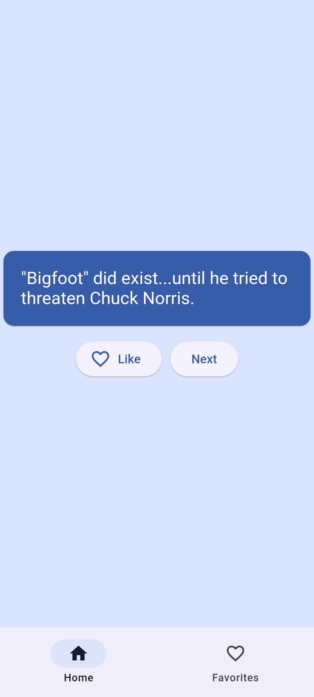

<h1 align="center">
  <sub>
    
  </sub>
  Silly Redirect for Zoom Meetings
</h1>

<p align="center">
  
</p>

Welcome to Chuck Jokes, a fun and exciting application developed using Flutter for Android devices. This application fetches random Chuck Norris jokes from the [chucknorris.io API](https://api.chucknorris.io/) and displays them in a user-friendly interface. You can also save your favorite jokes and share them with others.

## Features

* **Random Jokes**: Fetches random Chuck Norris jokes from the chucknorris.io API.
* **Save Favorites**: Save your favorite jokes and access them later.
* **Share Jokes**: Share your favorite jokes with friends and family.

## Installation

To run this application, you need to have Flutter installed on your machine. If you haven't done so, you can download Flutter from its [official website](https://flutter.dev/). Once Flutter is installed, navigate to the root directory of the project and run the following commands:

```bash
flutter clean
flutter pub get
flutter run --release
```

These commands will clean up the build cache, fetch the necessary dependencies, and run the application in release mode.

## Usage

Once the application is running, you will see a screen displaying a random Chuck Norris joke. Below the joke, there are two buttons: one to mark the joke as a favorite and another to fetch a new joke. To view your favorite jokes, tap on the 'Favorites' tab at the bottom of the screen. From there, you can delete individual jokes or share them via your preferred method.

## Contributing

Contributions are always welcome! Whether it's a bug report, feature request, or enhancement suggestion, feel free to open an issue or submit a pull request.

## License

This project is licensed under the MIT License. See the [LICENSE](LICENSE) file for details.
