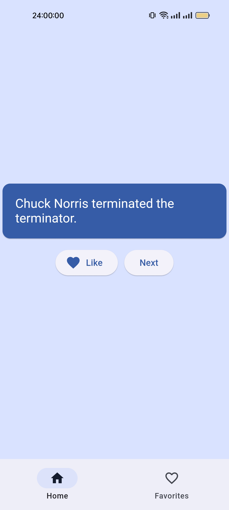

<h1 align="center">
 <sub>
   
 </sub>
 Chuck Jokes
</h1>

<p align="center">
    <a href="https://github.com/EdoardoTosin/chuck_jokes/releases/latest">
        </a>
    
	<a href="https://github.com/EdoardoTosin/chuck_jokes/blob/main/LICENSE">
		</a>
</p>
<!--
<p align="center">
    <a href="https://github.com/EdoardoTosin/chuck_jokes/releases/latest/download/chuck-norris-android-arm64-v8a-release.apk">
    </a>
    <a href="https://github.com/EdoardoTosin/chuck_jokes/releases/latest/download/chuck-norris-android-armeabi-v7a-release.apk">
    </a>
    <a href="https://github.com/EdoardoTosin/chuck_jokes/releases/latest/download/chuck-norris-android-x86_64-release.apk">
    </a>
</p>
-->
<p align="center">
 
</p>

Welcome to Chuck Jokes, a fun and exciting application developed using Flutter for Android devices.
This application fetches random Chuck Norris jokes from the chucknorris.io API and displays them in a user-friendly interface. You can also save your favorite jokes and share them with others.

## Features

- **Random Jokes**: Fetches random Chuck Norris jokes from the chucknorris.io API.
- **Save Favorites**: Save your favorite jokes and access them later.
- **Share Jokes**: Share your favorite jokes with friends and family.

## Installation

### Pre-built Android Release APK

To download the pre-built APKs from the releases on GitHub, follow these steps:

1. Go to the [releases page](https://github.com/EdoardoTosin/chuck_jokes/releases/latest).
2. Find the latest release and under the assets section, click on the APK file to download it.
3. After the download completes, open your device's file manager.
4. Navigate to the Downloads folder (or wherever you chose to save it).
5. Locate the downloaded APK file and tap on it.
6. A prompt will appear asking if you want to open the file with a package installer. Tap on "Install".
7. Follow the on-screen instructions to complete the installation process.

Please note that to install APKs from unknown sources, you may need to enable "Unknown sources" in your security settings. However, this is generally not recommended due to potential security risks.

### Flutter Manual Build APK

To compile and build the APK manually from your desktop, follow these steps:

To run this application, you need to have Flutter installed on your machine. If you haven't done so, you can download Flutter from its [official website](https://flutter.dev/).
Before building and installing the app, ensure that you have properly configured your Android development environment. This includes setting up Android SDK and Android Virtual Device (AVD).
Once Flutter is installed run the following commands:

1. Clone the repository:
```bash
git clone https://github.com/EdoardoTosin/chuck_jokes.git
```

2. Navigate to the project directory:
```bash
cd chuck_jokes
```

3. Install dependencies:
```bash
flutter pub get
```

4. Build the app:
```bash
flutter build apk --split-per-abi --release
```

These commands will clean up the build cache, fetch the necessary dependencies, and run the application in release mode.

## Usage

Once the application is running, you will see a screen displaying a random Chuck Norris joke. Below the joke, there are two buttons: one to mark the joke as a favorite and another to fetch a new joke. To view your favorite jokes, tap on the 'Favorites' tab at the bottom of the screen. From there, you can delete individual jokes or share them via your preferred method.

<p align="center">
 
 &nbsp;&nbsp;
 
 &nbsp;&nbsp;
 
</p>

## Contributing

Before contributing, please read the [CONTRIBUTING.md](./CONTRIBUTING.md) and [CODE_OF_CONDUCT.md](./CODE_OF_CONDUCT.md) files. They provide guidelines on how to contribute effectively to the project.

## License

This project is licensed under the MIT License. See the [LICENSE](LICENSE) file for details.
